# Database-Project-2024-Semester-Spring

# Library Management System

## Jeremy Jacob - 345570451
## Daniel Frohlich - 345528780

## Overview

This system manages the operations of a library or archive, including book storage, book disposal, and book upkeep. The system consists of several modules that handle different aspects of the library's management:

1. **Book Management**: Creates and manages book records, including metadata like title, author, rarity, and genre.

2. **Employee Management**: Manages employee records, including their roles (Archivist, Restorationist, Disposal Worker).

3. **Archival Management**: Handles the storage and organization of books in archives and on shelves.

4. **Book Disposal**: Tracks the disposal of books, including the disposal method and the employee responsible.

5. **Book Upkeep**: Records the maintenance and restoration activities performed on books, including the tools used and the reason for the upkeep.

6. **Archival Assignment**: Manages the process of transferring books between different archives and shelves.

## Entity Relationship Diagram

The picture below is the ERD for our database.


This picture is our DSD/ our relational schema
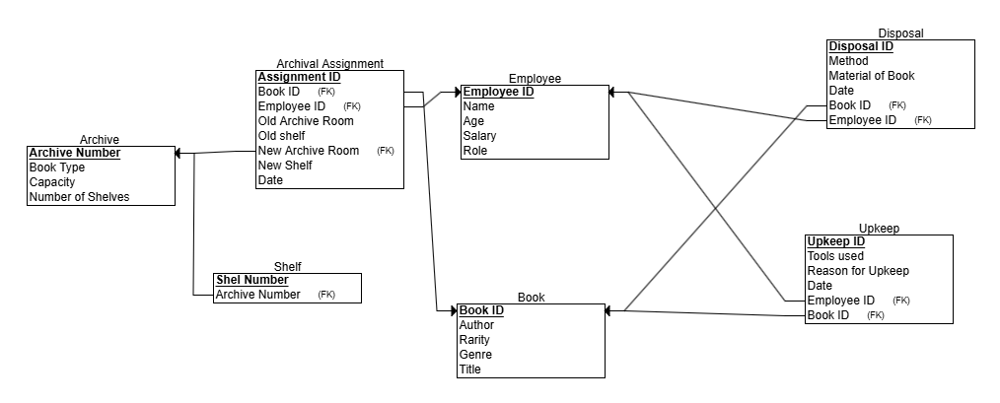

### Key Entities

1. **Book**: Represents a book in the library, with metadata such as title, author, rarity, and genre.

2. **Employee**: Represents an employee of the library, with attributes like ID, name, age, salary, and role.

3. **Archive**: Represents a physical archive storage unit, with attributes like archive number, book type, and capacity.

4. **Shelf**: Represents a shelf within an archive, with a unique shelf number.

5. **Disposal**: Tracks the disposal of a book, including the disposal method, material of the book, and the employee responsible.

6. **Upkeep**: Tracks the maintenance and restoration activities performed on a book, including the tools used and the reason for the upkeep.

7. **Archival Assignment**: Manages the process of transferring books between different archives and shelves, including the old and new locations and the employee responsible.

## Thought Process: Disposal and Upkeep as Separate Entities

Initially, the disposal and upkeep processes were considered as separate "room" entities. However, we decided to make them their own "job" entities. This decision was made to better represent the distinct nature of these operations and to capture the relevant details for each process.

### Benefits of Separate Entities

1. **Maintain Detailed Records**: Storing disposal and upkeep information in dedicated entities allows for more comprehensive tracking of activities.

2. **Facilitate Reporting and Analysis**: Separation enables more granular reporting and independent process monitoring.

3. **Enhance Workflow Management**: Better management of workflows and responsibilities associated with disposal and upkeep tasks.

4. **Support Scalability**: Provides a flexible approach to managing library/archive functions as the organization grows.

## Data Generation Scripts

The system includes several Python scripts for generating sample data:

- `book.py`: Generates book data
- `employee.py`: Generates employee data
- `archive.py`: Generates archive data
- `assignment.py`: Generates archival assignment data
- `disposal.py`: Generates book disposal data
- `upkeep.py`: Generates book upkeep data
- `shelf.py`: Generates shelf data

These scripts can be used to populate the system with sample data for testing, demonstrations, and training purposes.
We took the above python scripts and populated all the data onto csv files for each entity.
Following this, we then imported the data into PGAdmin and made a table for each entity using their respective csv files.
We have all the scripts, csv data files, and screenshots of loading them into PGAdmin under the "populate-scripts/datagen" folder in the repository.
Belows is one example screenshot.


## Future Enhancements

Potential future improvements include:

1. **User Interface**: Develop a web-based or desktop application for system interaction.

2. **Reporting and Analytics**: Implement advanced data analysis capabilities.

3. **Integrated Barcode/RFID System**: Streamline book tracking and inventory management.

4. **Automated Workflows**: Implement automated processes to enhance efficiency.

5. **Backup and Disaster Recovery**: Ensure data safety and integrity.

6. **Scalability and Performance Optimization**: Optimize system architecture for large-scale operations.


**Database Management Mini-Project – Stage 2**

**Project Stages**

**1. Backup**

**1.1 SQL Script Backup**

-   We used pg_dump to create a text-based and binary backup file containing DROP, CREATE, and INSERT statements.
    -   **Output File**: backupSQL.sql
    -   **Log File**: backupSQL.log

Dump Command:

```pg-dump -U postgres -h localhost -p 5432 –clean –create –inserts –column-inserts -f p -f backupSQL.sq1 postgres```

**1.2 PSQL Backup and Restore**

-   Created a binary backup file using pg_dump.
-   Cleared the database and restored it using pg_restore.
    -   **Output File**: backupPSQL.sql
    -   **Log File**: backupPSQL.log

Restore Command:

```pg_restore -U postgres -h localhost -p 5432 -d try1 –verbose –clean –if-exists backupPSQL,dump \> backupPSQL.log 2\>&1```

All 4 files are under the “git-lfs” folder in the repository.


**2. Queries**

**2.1 User Query Needs**

-   **4 SELECT Queries**:  
    Examples include retrieving data on books, employees, and processes.

    1 ) Get the shelves with the highest number of books in all archives

    ```sql
    SELECT s.archive_number, s.shelf_number, COUNT(b.book_id) AS total_books

    FROM shelf s

    LEFT JOIN archival_assignment aa ON s.archive_number = aa.new_archive_room AND s.shelf_number = aa.new_shelf

    LEFT JOIN book b ON aa.book_id = b.book_id

    GROUP BY s.archive_number, s.shelf_number

    ORDER BY total_books DESC;
    ```


    2 ) Archive employees with the most handled books

    ```sql
    SELECT e.employee_id, e.name, COUNT(DISTINCT aa.book_id) AS books_handled

    FROM employee e

    JOIN archival_assignment aa ON e.employee_id = aa.employee_id

    GROUP BY e.employee_id, e.name

    ORDER BY books_handled DESC

    LIMIT 10;
    ```


     3 ) Descending most common reasons for upkeep need

    ```sql
    SELECT u.reason_for_upkeep AS upkeep_reason, COUNT(\*) AS frequency

    FROM upkeep u

    GROUP BY u.reason_for_upkeep

    ORDER BY frequency DESC;
    ```

    4 ) Number of shredded or burned books in 2023

    ```sql
    SELECT COUNT(\*) AS books_disposed_count

    FROM (SELECT book_id FROM disposal WHERE disposal_method = 'Shredding' AND EXTRACT(YEAR FROM date) = 2023

    UNION ALL

    SELECT book_id FROM disposal WHERE disposal_method = 'Burning' AND EXTRACT(YEAR FROM date) = 2023

    ) disposed_books;
    ```

-   **2 UPDATE Queries**:  
    1 ) Update all the biographical books to be of the rarity type ‘common’

    ```sql
    UPDATE book

    SET rarity = 'Common'

    WHERE genre = 'Biography';
    ```

    2 ) Employee 1019 donated all paper books instead of disposing of them properly

    ```sql
    UPDATE disposal

    SET method = ‘Donation'

    WHERE employee_id = 1011 AND material_of_book = 'Paper';
    ```

-   **2 DELETE Queries**:  
    1 ) Delete all the disposal entries where employee 1019 donated paper books

    ```sql
    DELETE FROM disposal

    WHERE employee_id = 1019 AND method = 'Donation’

    AND material_of_book = 'Paper';
    ```

    2 ) Delete all the upkeep entries employee 1020 did between November 11, 2022 and November 11, 2024

    ```sql
     DELETE FROM upkeep

    WHERE employee_id = 1020

    AND date BETWEEN '2022-11-11' AND '2024-11-11';
    ```

**Screenshot**:


-   **Caption**: *"Shelves with the highest number of books in all archives"*

All regular queries are saved under the “queries” folder in the repository with accompanying screen shots.


**3. Parameterized Queries**

**3.1 User Query Needs**

-   Wrote four parameterized query requirements
1)  Search for book assignments by title ("Optional Analyzing Challenge")

```sql
DEALLOCATE find_reassignments;

PREPARE find_reassignments(text) AS

SELECT

aa.book_id, b.title, aa.employee_id, aa.date

AS assignment_date, aa.new_archive_room, aa.new_shelf

FROM archival_assignment aa

JOIN

book b ON aa.book_id = b.book_id

WHERE b.title = \$1

ORDER BY aa.date DESC;

EXECUTE find_reassignments('Optional Analyzing Challenge');
```

2) All books disposed by a given employee ("Zachary Frost") in disposal in a given year ("2023")

```sql
DEALLOCATE find_disposals;

PREPARE find_disposals(text, int) AS

SELECT

d.book_id, b.title d.disposal_method, d.material_of_book, d.date

AS disposal_date

FROM disposal d

JOIN book b ON d.book_id = b.book_id

JOIN employee e ON d.employee_id = e.employee_id

WHERE e.name = \$1 AND EXTRACT(YEAR FROM d.date) = \$2

ORDER BY d.date DESC;

EXECUTE find_disposals('Zachary Frost', 2023);
```

3) Shelves with the most books on them in a given archive room ("26")

```sql
DEALLOCATE find_shelves;

PREPARE find_shelves(int) AS

SELECT

s.shelf_number, COUNT(aa.book_id) AS book_count

FROM shelf s

LEFT JOIN archival_assignment aa ON s.archive_number = aa.new_archive_room AND s.shelf_number = aa.new_shelf

WHERE s.archive_number = \$1

GROUP BY s.shelf_number

ORDER BY book_count DESC;

EXECUTE find_shelves(26);
```

4) Employees who make more than a given amount ("50000") and are older than a given age ("45")

```sql
DEALLOCATE find_employees;

PREPARE find_employees(int, int) AS

SELECT

employee_id, name, age, salary, role

FROM employee

WHERE salary \> \$1 AND age \> \$2

ORDER BY salary DESC;

EXECUTE find_employees(50000, 45);
```

**Screenshot**:  


-   **Caption**: *"Search for book assignments by title"*

All parametrized queries are saved in the “paramqueries” file in the repository with accompanying screenshots of examples that we ran.


**4. Indexed Structures**

**4.1 Index Creation**

The structure to create an index on an attribute is as follows:

CREATE INDEX {index_variable_name} ON {selected_table} (attribute1, attribute2…);

-   We added the following custom indices to speed up selected queries.

    Book Table –

1.  Genre

Archival Assignment Table –

1.  New-Archive-Room
2.  Employee-ID

**4.2 Timing and Comparison**

We did the 3 following queries:

1.  ```SELECT * FROM book WHERE genre = ‘Fantasy’```
2.  ```SELECT * FROM archival_assignment WHERE new_archive_room BETWEEN 10 AND 30;```
3.  ```SELECT * FROM archival_assignment WHERE employee_id BETWEEN 1006 AND 1026;```

We have a table showing each query’s speed before the indexing and after the indexing.

| Query  | **Befroe Indexing (ms** | **After Indexing (ms)** | **Speed Increase** |
|--------|-------------------------|-------------------------|--------------------|
| 1      | 249                     | 98                      | 2.5x               |
| 2      | 241                     | 188                     | 1.2x               |
| 3      | 789                     | 196                     | 4x                 |

**Screenshot**:  


-   **Caption**: *"Indexing the 'genre' attribute in the Book table."*

The indexed SQL screenshots are saved under the “indexing” file in the repository.


**5. Constraints**

**5.1 Adding Constraints**

-   We used ALTER TABLE to add UNIQUE and CHECK constraints.

Syntax: ALTER TABLE {table} ADD CONSTRAINT {constraint_name} {TYPE-OF-CONSTRAINT} (attribute);

**5.2 Testing Constraints**

-   Ran INSERT, UPDATE, and DELETE queries to test constraint violations.
    1.  We added a constraint that Employee Names are unique

        ```INSERT INTO employee VALUES (1056, 25, 12000, ‘Archivist’, ‘Bob’)```

        ```INSERT INTO employee VALUES (1134, 43, 18000, ‘Disposal, ‘Bob’)```

        ERROR: Name ‘Bob’ in the second insert violates the unique name constraint.

    2.  We have entities that have foreign keys belonging to Employee

    ```DELETE FROM employee WHERE employee_id = 1012;```

    ERROR: This deletion violates the foreign key constraints and we would have keys in disposal, upkeep, and assignment belonging to people that no longer exist in the database

    3.  We had a constraint where book rarity can only be classified by 1 of 4 types : ‘Common’, ‘Rare’, ‘Very Rare, ‘Legendary’

        ```UPDATE book SET rarity = 'Uber Rare' WHERE book_id = 1000167698;```

        ERROR: The update to rarity is trying to make it of a type that doesn’t belong in our allowed set.

**Screenshot**:  
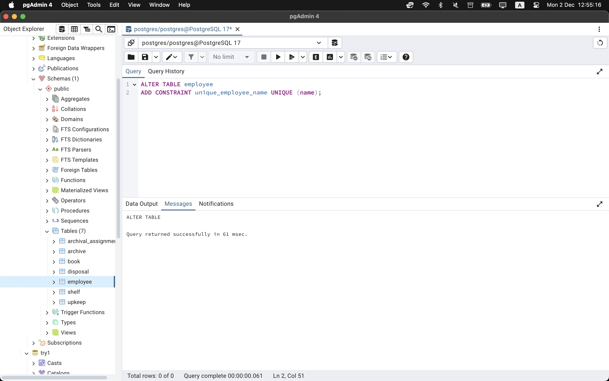

-   **Caption**: *"Adding the unique constraint to user names."*

All code and screenshots for the constraints can be found in the “constraints” file of our repository.


**README: Stage 3**

**Overview**

In Stage 3 of the database project, we focus on enhancing the database's functionality by introducing advanced queries, views, visualizations, and reusable functions. These additions aim to optimize the database's usability and efficiency while ensuring comprehensive documentation and error handling.

**Tasks and Implementation**

**1\. Joined queries**

**Objective**: Extend the database with three advanced queries utilizing multi-table joins.

**What we did:**

Write SELECT or UPDATE queries involving multiple tables to address complex data retrieval needs.

**Query 1** )

List all the upkeeps including employee_name and the book_title, to give an extended look at the information of the upkeeps in an extended table through two joins
```sql
SELECT DISTINCT e.name AS employee_name,

b.book_id,

b.title AS book_title,

u.reason_for_upkeep,

u.tools_used,

u.date

FROM public.employee e

JOIN public.upkeep u ON e.employee_id = u.employee_id

JOIN public.book b ON u.book_id = b.book_id

ORDER BY b.book_id ASC, e.name, u.date DESC;
```
**Query 2 )**

Show disposed books but also additional information like employee_name, for example to create an extended chart
```sql
SELECT b.title AS book_title,

d.disposal_method,

d.material_of_book,

d.date AS disposal_date,

e.name AS employee_name

FROM public.disposal d

JOIN public.book b ON d.book_id = b.book_id

JOIN public.employee e ON d.employee_id = e.employee_id

ORDER BY d.date DESC;
```
**Query 3 )**

SQL join that reassigns all of Michaela's August 2024 upkeep assignments to Traci Smith

```sql
UPDATE public.upkeep u
SET employee_id = e2. employee_id
FROM public. employee el
JOIN public. employee e2 ON e2. name = 'Traci Smith'
WHERE u. employee_id = el. employee_id
  AND el. name = 'Michaela Moore'
  AND u.date BETWEEN '2024-08-01' AND '2024-08-31';
```

- For query 3, we have before and after screenshots of both Micaela and Traci to show the reassignments in the data. All code and picture references at the end of section 1.

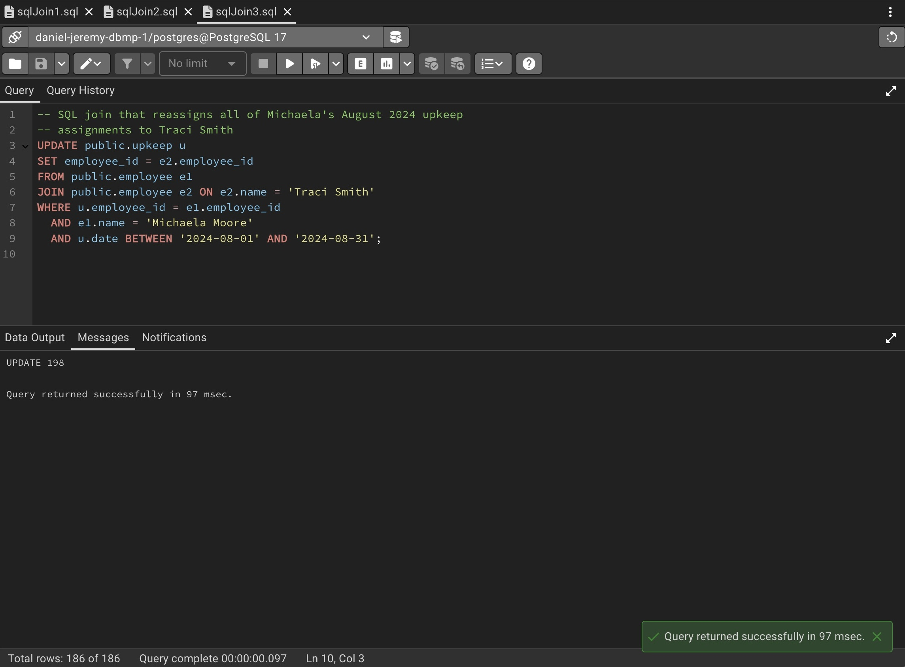
**Caption**: Shows update operation and its execution time

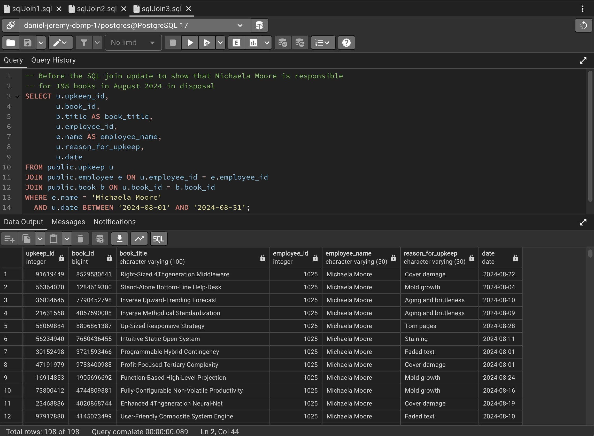
**Caption**: Shows how many books are assigned to Michaela before the update

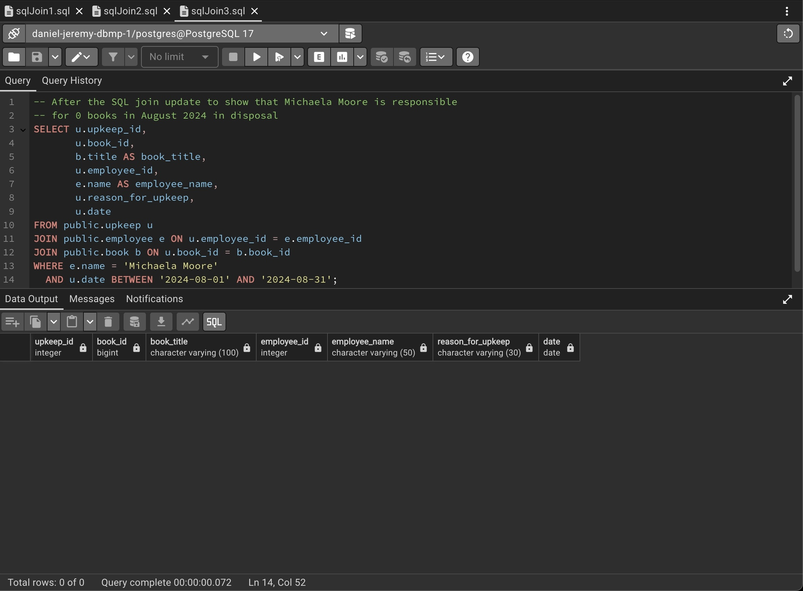
**Caption**: Shows how many books are assigned to Michaela after the update

All joined queries code and their accompanying screen shots can be found in the “joined-queries” folder in the main repository. All times are logged on the screenshots automatically of each query.

**2\. Views**

**Objective**: Create virtual tables (views) to address specific user requirements and ensure data integrity with manipulable records.

**Tasks**:

- Create four views tailored to the needs of different user sub-groups.
- For each view:
  - Implement a SELECT query.
  - Include INSERT, UPDATE, or DELETE operations.
  - Simulate both valid and invalid data manipulations to test constraints.

**View 1.** A view of all the books that start with the letter D

The CREATE query:
```sql
CREATE VIEW books_starting_with_D AS

SELECT book_id, title

FROM book

WHERE title LIKE 'D%'

WITH CHECK OPTION;
```

The SELECT query: Select all the books that start with D and have the word engineered in them
```sql
SELECT \*

FROM books_starting_with_d

WHERE title ILIKE '%engineered%';
```

The INSERT query: Attempting to insert a book starting with F even though we used a check condition, so it didn’t work.
```sql
INSERT INTO books_starting_with_D (book_id, title, author,rarity,genre)

VALUES (1029463947, 'Fantasy Adventure', 'John Doe', 'Rare', 'Fantasy');
```

The UPDATE query: Update all the books by people with initials M and J to rarity of rare
```sql
UPDATE books_starting_with_d

SET rarity = 'Rare'

WHERE author ILIKE 'M% J%';
```

The DELETE query: Delete from all the books starting with D those who's genre is biography which gave a foreign key constraint error
```sql
DELETE FROM books_starting_with_d

WHERE genre = 'Biography';
```

**View 2.** Make a view of only archival employees

The CREATE query:
```sql
CREATE VIEW Archival_Employee AS

SELECT \*

FROM employee

WHERE role = 'Archivist'

WITH CHECK OPTION;
```

The SELECT query: Select all the archival employees who make at least 85,000 dollars
```sql
SELECT name, salary

FROM archival_employees

WHERE salary > 85000
```

The INSERT query: Inserting a Disposal worker into the Archivist view. It doesn’t work because it goes against the check, but it did put it into the table of employee.
```sql
INSERT INTO archival_employees (employee_id, age, salary, role, name)

VALUES (2020, 30, 40000, 'Disposal Worker', 'John Doe');
```

The UPDATE query: Updating one of the archival employees in the view to a different job. This will update the view and then because of the check condition will remove them from the view and update the underlying table to give them the new role.
```sql
UPDATE archival_employees

SET role = 'Restorationist'

WHERE employee_id = 1001;
```

The DELETE query: Deleting all archivists who make more then 85,000 dollars. We will run into a foreign key constraint because three entities (upkeep, disposal, and archival assignment) depend on employee
```sql
DELETE FROM archival_employees

WHERE salary > 85000;
```

**View 3.** A view of all authors who wrote a fantasy book with the columns author name, genre, and book id.

The CREATE query:
```sql
CREATE VIEW fantasy_authors AS

SELECT author, genre, book_id

FROM book

WHERE genre = 'Fantasy'

WITH CHECK OPTION;
```

The SELECT query: Select all the fantasy authors whose first name begins with an 'M 'and last name begins with a 'J'.
```sql
SELECT \*

FROM fantasy_authors

WHERE author ILIKE 'M% J%';
```

The INSERT query: Insert a new fantasy book into the book table. It will reflect in the fantasy_authors view
```sql
INSERT INTO book (book_id, title, author, rarity, genre)

VALUES (67893, 'The book of things 2', 'Some dude again', 'Common', 'Fantasy');
```

The UPDATE query: Updating the book we just put in to another genre to see what happens. The check option prevented the update
```sql
UPDATE fantasy_authors

SET genre = 'Science'

WHERE book_id = 67893
```

The DELETE query: Now deleting from book all books with the name of the fantasy book we just inserted into the view. It doesn’t have any dependencies so it will be removed from the table book and also the view fantasy_authors
```sql
DELETE FROM book

WHERE author = 'Some dude again'
```

**View 4.** A list of all the employees by name with the amount of books, who have burned more then 360 books for disposal.

The CREATE query:
```sql
CREATE VIEW Pyromaniacs AS

SELECT e.name, COUNT(\*) AS books_burned

FROM disposal d

JOIN employee e

ON d.employee_id = e.employee_id

WHERE d.method = 'Incineration'

GROUP BY e.name

HAVING COUNT(\*) > 360;
```

The SELECT query: Select from the pyromaniacs all those who burned less then 200 books. This will give an empty list because we only took those who burned at least 360 books to make our view
```sql
SELECT \*

FROM pyromaniacs

WHERE books_burned < 200
```

The INSERT query: Making a new disposal entry where one of our pyromaniacs burns another book. We shall see if it updates the view. After this executed we saw that it added another tally to employee number 1024 for number of books burned in our view.
```sql
INSERT INTO disposal

VALUES (17, 67890, 1024, 'Incineration', 'Paper', '2024-02-02')
```

The UPDATE query: Updating our entry of the insert to a different method in the disposal table where it will remove the tally from the employee. After running the code we see it removed a tally from the employee who did this disposal in pyromaniac
```sql
UPDATE disposal

SET method = 'Donation'

WHERE disposal_id = 17
```
The DELETE query: We have employee 'Zachary Frost' with 368 burnings. We will delete 20 of them and that should remove him from the pyromaniacs view. After running the code we see he was removed form the view because he now doesn’t meet the criteria of burning at least 360 books
```sql
WITH rows_to_delete AS (

   SELECT ctid

   FROM disposal

   WHERE employee_id = (

       SELECT employee_id

       FROM employee

       WHERE name = 'Zachary Frost'

   )

  AND method = 'Incineration'

  ORDER BY ctid

  LIMIT 20

)

DELETE FROM disposal

WHERE ctid IN (SELECT ctid FROM rows_to_delete);
```

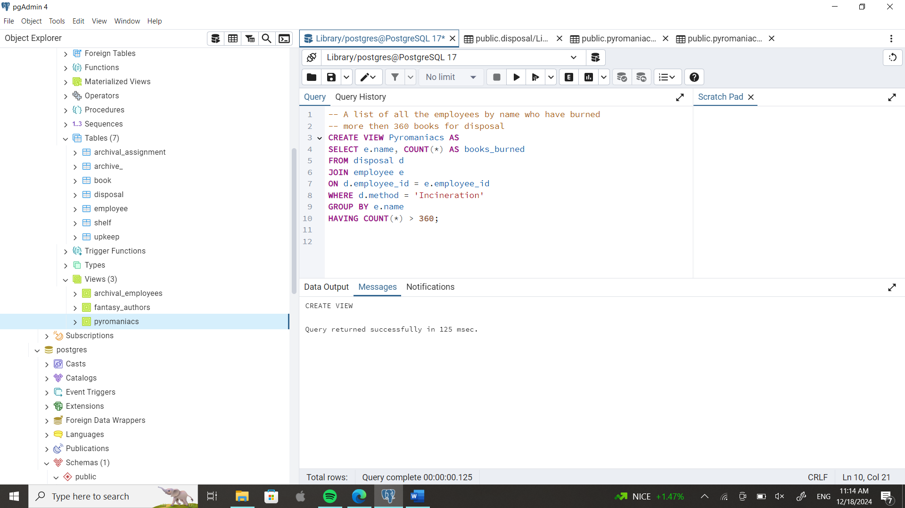
**Caption**: The code to create the pyromaniac view.

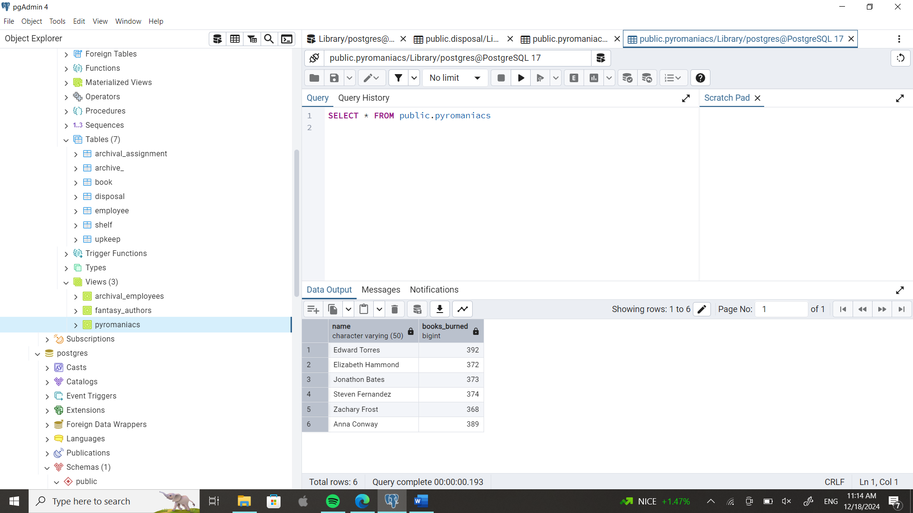
**Caption**: What the pyromaniac view looks like.

All the code and screenshots for all the views can be found in the “View” file in the main repository.

**3\. Visualizations**

**Objective**: Represent query results as visual plots to enhance interpretability.

**Tasks**:

- Prepare queries on the created views using pgAdmin.
- Generate two different types of visualizations (e.g., pie chart and bar graph).
- Embed the plots in the README with explanatory notes.

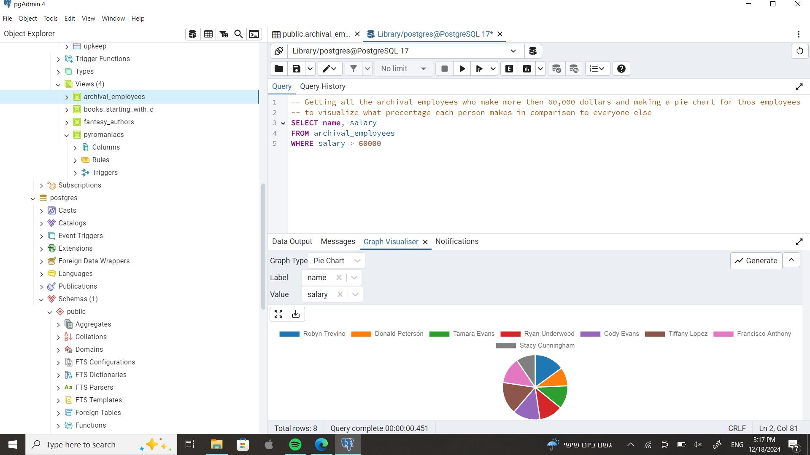
**Caption**: Pie chart representing the query results for \[SELECT name, salary FROM archival_employees WHERE salary > 60000\], after sifitng out those who made less then 60,000 dollars.

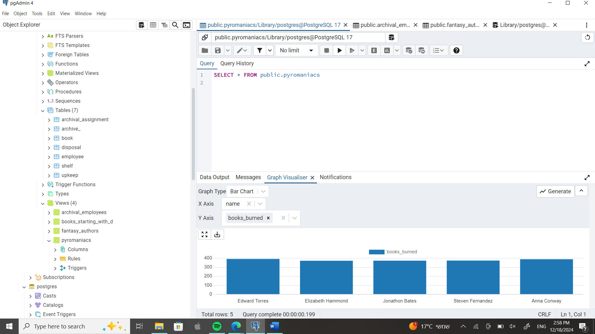
**Caption**: Bar graph showing all the employees who burned more then 360 books. \[SELECT \* FROM public.pyromaniacs\].

All the screenshots appear in the “visualizations” folder of the main repository, along with screenshots of the accompanying data in a table.

**4\. Functions**

**Objective**: Optimize query writing by implementing reusable functions.

**Tasks**:

- Write four functions to simplify repetitive or complex query sections into the file Functions.sql.
- Replace original SQL with function-based equivalents in Queries.sql.

**Functions:**

Function 1: Get employee_id given a name
```sql
CREATE OR REPLACE FUNCTION get_employee_id_by_name(emp_name VARCHAR)

RETURNS INTEGER AS $$

DECLARE

emp_id INTEGER;

BEGIN

SELECT employee_id INTO emp_id

FROM public.employee

WHERE name = emp_name;

RETURN emp_id;

END;

$$ LANGUAGE plpgsql;
```

Updated SQL query that can now get an employee_id from a name and search through disposals of that employee_id, streamlining disposal employee search
```sql
SELECT b.title AS book_title,

d.disposal_method,

d.material_of_book,

d.date AS disposal_date,

e.name AS employee_name

FROM public.disposal d

JOIN public.book b ON d.book_id = b.book_id

JOIN public.employee e ON d.employee_id = e.employee_id

WHERE e.employee_id = get_employee_id_by_name('Zachary Frost')

ORDER BY d.date DESC;
```


Function 2: Get books by title and date
```sql
CREATE OR REPLACE FUNCTION get_books_by_title_and_date(book_title VARCHAR, start_date DATE, end_date DATE)

RETURNS TABLE(book_id BIGINT) AS $$

BEGIN

RETURN QUERY

SELECT b.book_id

FROM public.book b

JOIN public.upkeep u ON b.book_id = u.book_id

WHERE b.title = book_title

AND u.date BETWEEN start_date AND end_date;

END;

$$ LANGUAGE plpgsql;
```

Updated SQL query that now takes a book TITLE, not just id, and given dates, and can return all the upkeeps from that book within a given timeframe.
```sql
SELECT u.upkeep_id,

b.book_id,

b.title AS book_title,

e.name AS employee_name,

u.reason_for_upkeep,

u.tools_used,

u.date AS upkeep_date

FROM public.upkeep u

JOIN public.book b ON u.book_id = b.book_id

JOIN public.employee e ON u.employee_id = e.employee_id

WHERE b.book_id IN (

SELECT book_id

FROM get_books_by_title_and_date('Organic 3Rdgeneration Alliance', '2024-07-01', '2024-10-31')

)

ORDER BY u.date DESC, e.name;
```


Function 3: Reassign upkeep assignments from one employee to another
```sql
CREATE OR REPLACE FUNCTION reassign_upkeep_to_employee(old_emp_name VARCHAR, new_emp_name VARCHAR, start_date DATE, end_date DATE)

RETURNS VOID AS $$

DECLARE

old_emp_id INTEGER;

new_emp_id INTEGER;

BEGIN

\-- Get employee IDs

old_emp_id := get_employee_id_by_name(old_emp_name);

new_emp_id := get_employee_id_by_name(new_emp_name);

\-- Perform update

UPDATE public.upkeep

SET employee_id = new_emp_id

WHERE employee_id = old_emp_id

AND date BETWEEN start_date AND end_date;

END;

$$ LANGUAGE plpgsql;
```

Updated SQL query that reassigns different upkeep assignments within a given timeframe from one employee to another
```sql
SELECT reassign_upkeep_to_employee('Stacey Mcconnell', 'Jerry Lyons', '2024-05-01', '2024-05-31');
```


Function 4: Get upkeep details by employee name to see all upkeep info
```sql
CREATE OR REPLACE FUNCTION get_upkeep_details_by_employee(emp_name VARCHAR, start_date DATE, end_date DATE)

RETURNS TABLE(

upkeep_id INTEGER,

book_id BIGINT,

book_title VARCHAR,

reason_for_upkeep VARCHAR,

date DATE

) AS $$

BEGIN

RETURN QUERY

SELECT u.upkeep_id, u.book_id, b.title, u.reason_for_upkeep, u.date

FROM public.upkeep u

JOIN public.book b ON u.book_id = b.book_id

JOIN public.employee e ON u.employee_id = e.employee_id

WHERE e.name = emp_name

AND u.date BETWEEN start_date AND end_date;

END;

$$ LANGUAGE plpgsql;
```

Updated SQL query that returns extended upkeep details for specific emplyee in specific timeframe
```sql
SELECT \* FROM get_upkeep_details_by_employee('Jerry Lyons', '2024-05-01', '2024-05-31');
```

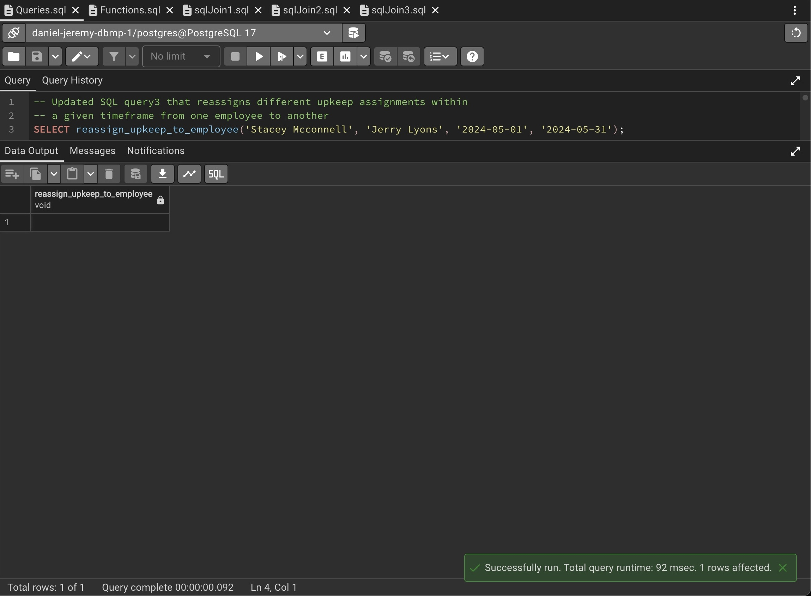
**Caption**: Reassigns upkeep assignments from Employee A to Employee B in a certain time frame.

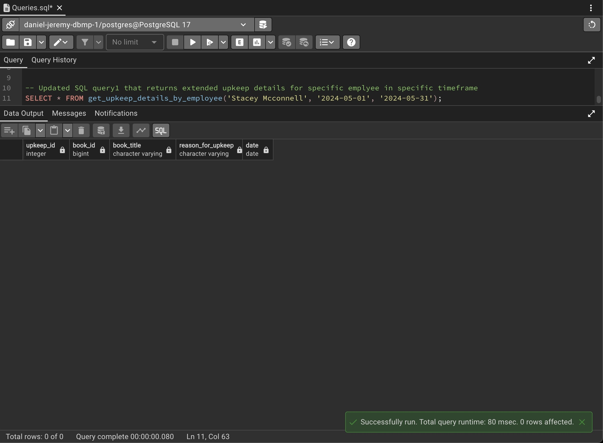
**Caption**: We see Stacey who was Employee A now has no assigments in the specified time frame

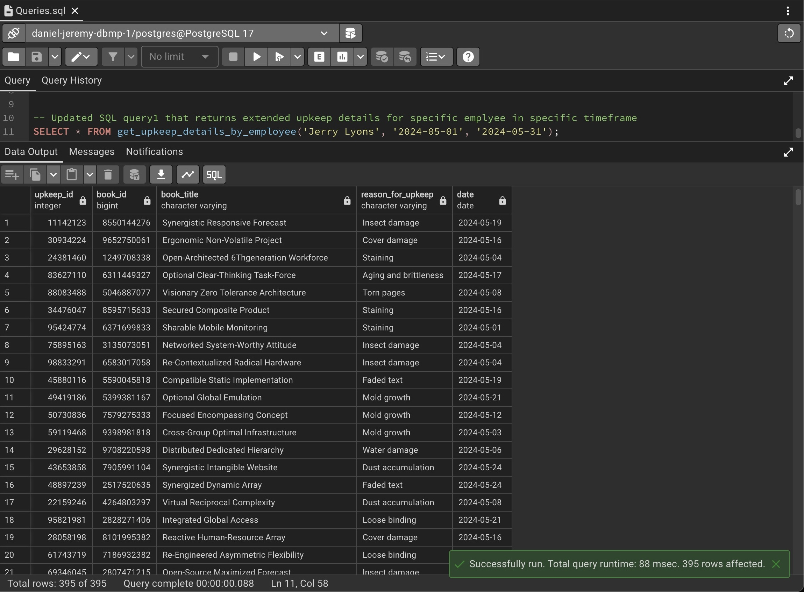
**Caption**: We see Jerry, Employee B, has many assignments because he took all the assignemtns from Stacey

All the code and screenshots for functions can be found in the “Functions” folder of the main repository.

# README: Stage 4

## Overview

Stage 4 of the database project focuses on enhancing the database functionality by integrating the data of another table and schema effectively to meet the requirements of different user sub-groups, creating views, and adding queries. The tasks in this stage are designed to optimize database operations and improve usability.

---

## Entity Relationship Diagram (ERD)

In this section, we provide visual representations of the Entity Relationship Diagrams (ERDs) for the project. There are three ERDs presented: our original ERD, the other team's ERD, and the merged ERD.

### ERD Explanations

1. **Our Original ERD**: This represents the database schema initially created, focusing on key entities like `Book`, `Employee`, `Archive`, and functions surrounding those entities like `Upkeep`, `Disposal`, and `Archival Assignments`.

   **OUR ERD PIC**

2. **Other Team’s ERD**: This shows the structure provided by the other team, which we aim to integrate with our own schema. They had a lot more entities and more connective entities.

3. **Merged ERD**: The final ERD, which combines the original and other team's ERD, creating a unified database schema for the system. We had to take some attributes of ours and make them into their own tables while adding other attributes to `Book`, which is the main entity for both our schemas. A more technical explanation will be given down below.

All the ERDs can be found in the media file of the main repository.

---

## Data Structure Diagram (DSD)

The combined DSD is based on the integrated ERD. It is very similar to our original DSD in terms of the structure of our original entities, with the exception of `Archival Assignment`, which now points to a `Location` entity. The ERD has many added entities from the other group that all depend on `Book` and a few entities that `Book` itself depends on, which is new to our DSD (because in our original DSD, `Book` did not rely on anything).

**Insert DSD image here.**

---

## Changes for Integration

During this stage, efforts were made to integrate data from multiple sources, ensuring smooth operation across tables and views. The integration process involved handling foreign key constraints, resolving naming conflicts, having similar schemas for identical entities, and generating data to fit both databases.

### Key Steps Taken:

1. **Normalizing the Book schema**: We decided to make our `Book` entity match theirs. So we had to get rid of some of our attributes (e.g., `author`, `genre`, etc.) and made those into separate entities like the other group had.
2. **Truncating the data**: We then had to wipe the data from our own tables but leave the actual tables intact, so we used `TRUNCATE`.
3. **Repopulating our data**: We repopulated our tables that don’t interact with their database so much (e.g., `upkeep`, `disposal`, etc.).
4. **Rarity**: `Rarity` is the only new entity not seen before in either group's table. So we had to create the table for it and populate data within it.
5. **Using their DB as a base**: We then decided that since they had more entities than we did, we would use their DB as a base, and we reinitialized our tables into a database that had their schemas already.
6. **Transfer and Dump**: Finally, we transferred the data from our table to the new one and did a dump from their original table into our new combined one. What we ended up with was a DB that has our data through transfers and their data from a dump.

---

## Tasks and Implementation

### View 1: Lookup View

#### **Objective**:
Due to the many minor tables that we have, we are going to make a view that gives us all the information we want on one table instead of having to look through multiple tables.

#### **Create View**:
```sql
CREATE OR REPLACE VIEW lookup_view AS
SELECT 
    b.id AS book_id,
    b.title AS book_title,
    b.release_date AS release_date,
    b.page_count AS page_count,
    b.format AS book_format,
    b.description AS description,
    b.isbn AS isbn,
    l.name AS language,
    r.rarity_level AS rarity,
    a.first_name || ' ' || a.last_name AS author_name,
    g.name AS genre,
    p.name AS publisher_name,
    p.phone_number AS publisher_contact,
    p.website AS publisher_website
FROM 
    book b
LEFT JOIN written_in wi ON b.id = wi.id
LEFT JOIN language l ON wi.language_id = l.language_id
LEFT JOIN rarity r ON b.id = r.id
LEFT JOIN written_by wb ON b.id = wb.id
LEFT JOIN author a ON wb.author_id = a.author_id
LEFT JOIN type_of to_genre ON b.id = to_genre.id
LEFT JOIN genre g ON to_genre.genre_id = g.genre_id
LEFT JOIN published_by pb ON b.id = pb.id
LEFT JOIN publisher p ON pb.publisher_id = p.publisher_id;
```

#### **Queries for View 1**:

1. **SELECT Query**: Easily and efficiently selects all the lookup tables for 'Romance' books released from 2026 and on.
   ```sql
   SELECT DISTINCT
    author_name,
    book_title,
    release_date,
    genre,
    language,
    publisher_name
    FROM 
    lookup_view
    WHERE 
    release_date > '2016-01-01'
    AND genre = 'Romance'
    ORDER BY 
    release_date ASC;
    ```

2. **INSERT Query**: Sample easy insert statement that inserts a book into the database with the given info.
   ```sql
   INSERT INTO lookup_view (
    book_id,
    book_title,
    release_date,
    page_count,
    book_format,
    description,
    isbn,
    language,
    rarity,
    author_name,
    genre,
    publisher_name
    )
    VALUES (
    7381927364,
    'The Heart of Databases',
    '2025-01-01',
    400,
    'Hardcover',
    'A comprehensive guide to databases.',
    43210123,
    'English',
    'Rare',
    'Zachary Albacrosster',
    'Technology',
    'Tech Publishers'
    );
    ```

3. **UPDATE Query**: Selects rare titles with more than 500 pages, and sorts by how many languages they are in.
   ```sql
   UPDATE lookup_view
    SET 
    book_title = 'The Updated Title of Databases',
    release_date = '2024-01-01',
    page_count = 450,
    book_format = 'Paperback',
    description = 'An updated guide to databases.',
    isbn = 98765432,
    language = 'Spanish',
    rarity = 'Common',
    author_name = 'Frederick Gonepigs',
    genre = 'Science',
    publisher_name = 'Newly Refreshed Tech Publishers'
    WHERE book_id = 7381927364;
    ```

4. **DELETE Query**: Deletes from the lookup view the previously inserted book, showcasing the efficiency of the lookup view.
   ```sql
   DELETE FROM lookup_view
   WHERE book_id = 7381927364;
    ```

5. **SELECT Query 2**: Selects from the lookup view all the authors who start with 'A', counts their number of books, and returns their average page count.
   ```sql
   SELECT 
    publisher_name,
    COUNT(book_id) AS total_books,
    AVG(page_count) AS avg_page_count
    FROM lookup_view
    WHERE author_name LIKE 'A%'
    GROUP BY publisher_name
    ORDER BY avg_page_count DESC;
    ```

6. **UPDATE Query 2**: Labels all books from the 20th century as 'Legendary' and adds a ' - Special Anniversary Edition' suffix to the title.
   ```sql
   UPDATE lookup_view
    SET 
    book_title = book_title || ' - Special Anniversary Edition',
    book_format = 'Collector Edition',
    rarity = COALESCE(rarity, 'Legendary')
    WHERE 
    release_date < '2000-01-01'
    RETURNING 
    book_id, book_title, book_format, rarity;
    ```

Extra queries, more data, and screenshots can be found in the main repository -> “views-stage4” -> “view1-lookup” folder.

---

### View 2: Restorationist Upkeep

#### **Objective**:
Create a view of all the upkeep employees and the countries from which the books they fix come from. It then lists the number of books each employee fixed from each country, thus giving us an idea of the quality of books from certain countries.

#### **Create View**:
```sql
CREATE VIEW restorationist_upkeep_summary AS
SELECT 
    e.employee_id,
    c.name AS country_name,
    COUNT(u.id) AS upkept_books_count
FROM 
employee e
JOIN 
upkeep u ON e.employee_id = u.employee_id
JOIN 
    published_by pb ON u.id = pb.id
JOIN 
    is_in ii ON pb.publisher_id = ii.publisher_id
JOIN 
    country c ON ii.country_id = c.country_id
WHERE 
    e.role = 'Restorationist'
GROUP BY 
    e.employee_id, c.name
ORDER BY 
    e.employee_id, upkept_books_count DESC;
```

#### **Queries for View 2**:

1. **SELECT Query**: Select all the countries that published at least 2600 books that need restoration.
   ```sql
   SELECT 
   country_name, 
    SUM(upkept_books_count) AS total_upkept_books
    FROM 
    restorationist_upkeep_summary
    GROUP BY 
    country_name
    HAVING 
    SUM(upkept_books_count) > 2600;
    ```

2. **INSERT Query**: Insert into the underlying table of the view another entry. It will automatically update and appear in the view.
   ```sql
   INSERT INTO upkeep (upkeep_id, id, employee_id, tools_used, reason_for_upkeep, date)
   VALUES ( 12312 ,2141, 1003, 'Brush', 'Dust accumulation',CURRENT_DATE);   
    ```

3. **UPDATE Query**: Attempt to update the view directly. However, views are virtual tables and you can’t do that with them, so it will fail.
```sql
UPDATE restorationist_upkeep_summary
SET upkept_books_count = 1;
```

4. **DELETE Query**: We delete the country 'North Korea', which causes all entries in upkeep to disappear (thanks to delete cascade) and thus removes all North Korea entries from our view.
```sql
DELETE FROM country
WHERE name = 'North Korea';
```

5. **SELECT Query 2**: We want a list of the employee who restored the most books for a country, for each country.
```sql
SELECT 
    employee_id,
    country_name,
    upkept_books_count AS maxamountfromcountry
FROM restorationist_upkeep_summary
WHERE (country_name, upkept_books_count) IN (
    SELECT 
        country_name, 
        MAX(upkept_books_count) 
    FROM restorationist_upkeep_summary
    GROUP BY country_name;
```

6. **INSERT Query 2**: Add a new book to update that the publisher is from Samoa, and a new country should appear in our view.
```sql
INSERT INTO public.upkeep (upkeep_id, id, employee_id, tools_used, reason_for_upkeep, date)
VALUES (123456, 1, 1030, 'Brush', 'Dust accumulation', CURRENT_DATE);
```

All the data and extra queries for the second view can be found in the `View2` folder of the `views-stage4` folder found in the main repository.

---

