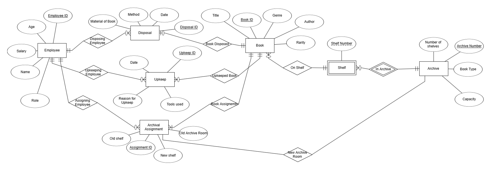
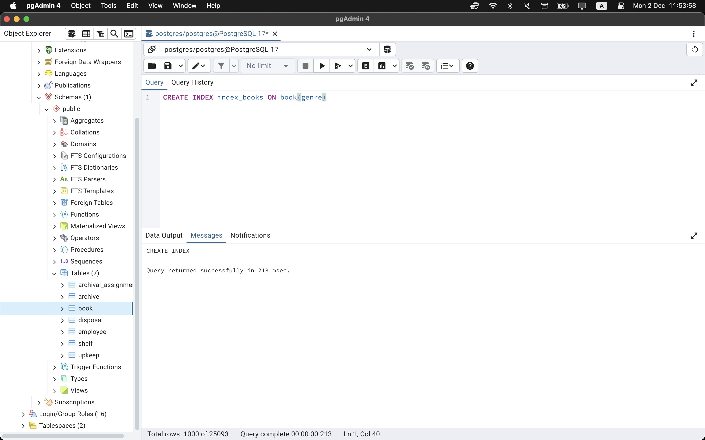

# Database-Project-2024-Semester-Spring

# Library Management System

## Jeremy Jacob - 345570451
## Daniel Frohlich - 345528780

## Overview

This system manages the operations of a library or archive, including book storage, book disposal, and book upkeep. The system consists of several modules that handle different aspects of the library's management:

1. **Book Management**: Creates and manages book records, including metadata like title, author, rarity, and genre.

2. **Employee Management**: Manages employee records, including their roles (Archivist, Restorationist, Disposal Worker).

3. **Archival Management**: Handles the storage and organization of books in archives and on shelves.

4. **Book Disposal**: Tracks the disposal of books, including the disposal method and the employee responsible.

5. **Book Upkeep**: Records the maintenance and restoration activities performed on books, including the tools used and the reason for the upkeep.

6. **Archival Assignment**: Manages the process of transferring books between different archives and shelves.

## Entity Relationship Diagram

The picture below is the ERD for our database.



This picture is our DSD/ our relational schema


### Key Entities

1. **Book**: Represents a book in the library, with metadata such as title, author, rarity, and genre.

2. **Employee**: Represents an employee of the library, with attributes like ID, name, age, salary, and role.

3. **Archive**: Represents a physical archive storage unit, with attributes like archive number, book type, and capacity.

4. **Shelf**: Represents a shelf within an archive, with a unique shelf number.

5. **Disposal**: Tracks the disposal of a book, including the disposal method, material of the book, and the employee responsible.

6. **Upkeep**: Tracks the maintenance and restoration activities performed on a book, including the tools used and the reason for the upkeep.

7. **Archival Assignment**: Manages the process of transferring books between different archives and shelves, including the old and new locations and the employee responsible.

## Thought Process: Disposal and Upkeep as Separate Entities

Initially, the disposal and upkeep processes were considered as separate "room" entities. However, we decided to make them their own "job" entities. This decision was made to better represent the distinct nature of these operations and to capture the relevant details for each process.

### Benefits of Separate Entities

1. **Maintain Detailed Records**: Storing disposal and upkeep information in dedicated entities allows for more comprehensive tracking of activities.

2. **Facilitate Reporting and Analysis**: Separation enables more granular reporting and independent process monitoring.

3. **Enhance Workflow Management**: Better management of workflows and responsibilities associated with disposal and upkeep tasks.

4. **Support Scalability**: Provides a flexible approach to managing library/archive functions as the organization grows.

## Data Generation Scripts

The system includes several Python scripts for generating sample data:

- `book.py`: Generates book data
- `employee.py`: Generates employee data
- `archive.py`: Generates archive data
- `assignment.py`: Generates archival assignment data
- `disposal.py`: Generates book disposal data
- `upkeep.py`: Generates book upkeep data
- `shelf.py`: Generates shelf data

These scripts can be used to populate the system with sample data for testing, demonstrations, and training purposes.
We took the above python scripts and populated all the data onto csv files for each entity.
Following this, we then imported the data into PGAdmin and made a table for each entity using their respective csv files.
We have all the scripts, csv data files, and screenshots of loading them into PGAdmin under the "populate-scripts/datagen" folder in the repository.
Belows is one example screenshot.


## Future Enhancements

Potential future improvements include:

1. **User Interface**: Develop a web-based or desktop application for system interaction.

2. **Reporting and Analytics**: Implement advanced data analysis capabilities.

3. **Integrated Barcode/RFID System**: Streamline book tracking and inventory management.

4. **Automated Workflows**: Implement automated processes to enhance efficiency.

5. **Backup and Disaster Recovery**: Ensure data safety and integrity.

6. **Scalability and Performance Optimization**: Optimize system architecture for large-scale operations.


**Database Management Mini-Project – Stage 2**

**Project Stages**

**1. Backup**

**1.1 SQL Script Backup**

-   We used pg_dump to create a text-based and binary backup file containing DROP, CREATE, and INSERT statements.
    -   **Output File**: backupSQL.sql
    -   **Log File**: backupSQL.log

Dump Command:

```pg-dump -U postgres -h localhost -p 5432 –clean –create –inserts –column-inserts -f p -f backupSQL.sq1 postgres```

**1.2 PSQL Backup and Restore**

-   Created a binary backup file using pg_dump.
-   Cleared the database and restored it using pg_restore.
    -   **Output File**: backupPSQL.sql
    -   **Log File**: backupPSQL.log

Restore Command:

```pg_restore -U postgres -h localhost -p 5432 -d try1 –verbose –clean –if-exists backupPSQL,dump \> backupPSQL.log 2\>&1```

All 4 files are under the “git-lfs” folder in the repository.


**2. Queries**

**2.1 User Query Needs**

-   **4 SELECT Queries**:  
    Examples include retrieving data on books, employees, and processes.

    1 ) Get the shelves with the highest number of books in all archives

    ```sql
    SELECT s.archive_number, s.shelf_number, COUNT(b.book_id) AS total_books

    FROM shelf s

    LEFT JOIN archival_assignment aa ON s.archive_number = aa.new_archive_room AND s.shelf_number = aa.new_shelf

    LEFT JOIN book b ON aa.book_id = b.book_id

    GROUP BY s.archive_number, s.shelf_number

    ORDER BY total_books DESC;
    ```


    2 ) Archive employees with the most handled books

    ```sql
    SELECT e.employee_id, e.name, COUNT(DISTINCT aa.book_id) AS books_handled

    FROM employee e

    JOIN archival_assignment aa ON e.employee_id = aa.employee_id

    GROUP BY e.employee_id, e.name

    ORDER BY books_handled DESC

    LIMIT 10;
    ```


     3 ) Descending most common reasons for upkeep need

    ```sql
    SELECT u.reason_for_upkeep AS upkeep_reason, COUNT(\*) AS frequency

    FROM upkeep u

    GROUP BY u.reason_for_upkeep

    ORDER BY frequency DESC;
    ```

    4 ) Number of shredded or burned books in 2023

    ```sql
    SELECT COUNT(\*) AS books_disposed_count

    FROM (SELECT book_id FROM disposal WHERE disposal_method = 'Shredding' AND EXTRACT(YEAR FROM date) = 2023

    UNION ALL

    SELECT book_id FROM disposal WHERE disposal_method = 'Burning' AND EXTRACT(YEAR FROM date) = 2023

    ) disposed_books;
    ```

-   **2 UPDATE Queries**:  
    1 ) Update all the biographical books to be of the rarity type ‘common’

    ```sql
    UPDATE book

    SET rarity = 'Common'

    WHERE genre = 'Biography';
    ```

    2 ) Employee 1019 donated all paper books instead of disposing of them properly

    ```sql
    UPDATE disposal

    SET method = ‘Donation'

    WHERE employee_id = 1011 AND material_of_book = 'Paper';
    ```

-   **2 DELETE Queries**:  
    1 ) Delete all the disposal entries where employee 1019 donated paper books

    ```sql
    DELETE FROM disposal

    WHERE employee_id = 1019 AND method = 'Donation’

    AND material_of_book = 'Paper';
    ```

    2 ) Delete all the upkeep entries employee 1020 did between November 11, 2022 and November 11, 2024

    ```sql
     DELETE FROM upkeep

    WHERE employee_id = 1020

    AND date BETWEEN '2022-11-11' AND '2024-11-11';
    ```

**Screenshot**:


-   **Caption**: *"Shelves with the highest number of books in all archives"*

All regular queries are saved under the “queries” folder in the repository with accompanying screen shots.


**3. Parameterized Queries**

**3.1 User Query Needs**

-   Wrote four parameterized query requirements
1)  Search for book assignments by title ("Optional Analyzing Challenge")

```sql
DEALLOCATE find_reassignments;

PREPARE find_reassignments(text) AS

SELECT

aa.book_id, b.title, aa.employee_id, aa.date

AS assignment_date, aa.new_archive_room, aa.new_shelf

FROM archival_assignment aa

JOIN

book b ON aa.book_id = b.book_id

WHERE b.title = \$1

ORDER BY aa.date DESC;

EXECUTE find_reassignments('Optional Analyzing Challenge');
```

2) All books disposed by a given employee ("Zachary Frost") in disposal in a given year ("2023")

```sql
DEALLOCATE find_disposals;

PREPARE find_disposals(text, int) AS

SELECT

d.book_id, b.title d.disposal_method, d.material_of_book, d.date

AS disposal_date

FROM disposal d

JOIN book b ON d.book_id = b.book_id

JOIN employee e ON d.employee_id = e.employee_id

WHERE e.name = \$1 AND EXTRACT(YEAR FROM d.date) = \$2

ORDER BY d.date DESC;

EXECUTE find_disposals('Zachary Frost', 2023);
```

3) Shelves with the most books on them in a given archive room ("26")

```sql
DEALLOCATE find_shelves;

PREPARE find_shelves(int) AS

SELECT

s.shelf_number, COUNT(aa.book_id) AS book_count

FROM shelf s

LEFT JOIN archival_assignment aa ON s.archive_number = aa.new_archive_room AND s.shelf_number = aa.new_shelf

WHERE s.archive_number = \$1

GROUP BY s.shelf_number

ORDER BY book_count DESC;

EXECUTE find_shelves(26);
```

4) Employees who make more than a given amount ("50000") and are older than a given age ("45")

```sql
DEALLOCATE find_employees;

PREPARE find_employees(int, int) AS

SELECT

employee_id, name, age, salary, role

FROM employee

WHERE salary \> \$1 AND age \> \$2

ORDER BY salary DESC;

EXECUTE find_employees(50000, 45);
```

**Screenshot**:  


-   **Caption**: *"Search for book assignments by title"*

All parametrized queries are saved in the “paramqueries” file in the repository with accompanying screenshots of examples that we ran.


**4. Indexed Structures**

**4.1 Index Creation**

The structure to create an index on an attribute is as follows:

CREATE INDEX {index_variable_name} ON {selected_table} (attribute1, attribute2…);

-   We added the following custom indices to speed up selected queries.

    Book Table –

1.  Genre

Archival Assignment Table –

1.  New-Archive-Room
2.  Employee-ID

**4.2 Timing and Comparison**

We did the 3 following queries:

1.  ```SELECT * FROM book WHERE genre = ‘Fantasy’```
2.  ```SELECT * FROM archival_assignment WHERE new_archive_room BETWEEN 10 AND 30;```
3.  ```SELECT * FROM archival_assignment WHERE employee_id BETWEEN 1006 AND 1026;```

We have a table showing each query’s speed before the indexing and after the indexing.

| Query  | **Befroe Indexing (ms** | **After Indexing (ms)** | **Speed Increase** |
|--------|-------------------------|-------------------------|--------------------|
| 1      | 249                     | 98                      | 2.5x               |
| 2      | 241                     | 188                     | 1.2x               |
| 3      | 789                     | 196                     | 4x                 |

**Screenshot**:  


-   **Caption**: *"Indexing the 'genre' attribute in the Book table."*

The indexed SQL screenshots are saved under the “indexing” file in the repository.


**5. Constraints**

**5.1 Adding Constraints**

-   We used ALTER TABLE to add UNIQUE and CHECK constraints.

Syntax: ALTER TABLE {table} ADD CONSTRAINT {constraint_name} {TYPE-OF-CONSTRAINT} (attribute);

**5.2 Testing Constraints**

-   Ran INSERT, UPDATE, and DELETE queries to test constraint violations.
    1.  We added a constraint that Employee Names are unique

        ```INSERT INTO employee VALUES (1056, 25, 12000, ‘Archivist’, ‘Bob’)```

        ```INSERT INTO employee VALUES (1134, 43, 18000, ‘Disposal, ‘Bob’)```

        ERROR: Name ‘Bob’ in the second insert violates the unique name constraint.

    2.  We have entities that have foreign keys belonging to Employee

    ```DELETE FROM employee WHERE employee_id = 1012;```

    ERROR: This deletion violates the foreign key constraints and we would have keys in disposal, upkeep, and assignment belonging to people that no longer exist in the database

    3.  We had a constraint where book rarity can only be classified by 1 of 4 types : ‘Common’, ‘Rare’, ‘Very Rare, ‘Legendary’

        ```UPDATE book SET rarity = 'Uber Rare' WHERE book_id = 1000167698;```

        ERROR: The update to rarity is trying to make it of a type that doesn’t belong in our allowed set.

**Screenshot**:  


-   **Caption**: *"Adding the unique constraint to user names."*

All code and screenshots for the constraints can be found in the “constraints” file of our repository.
